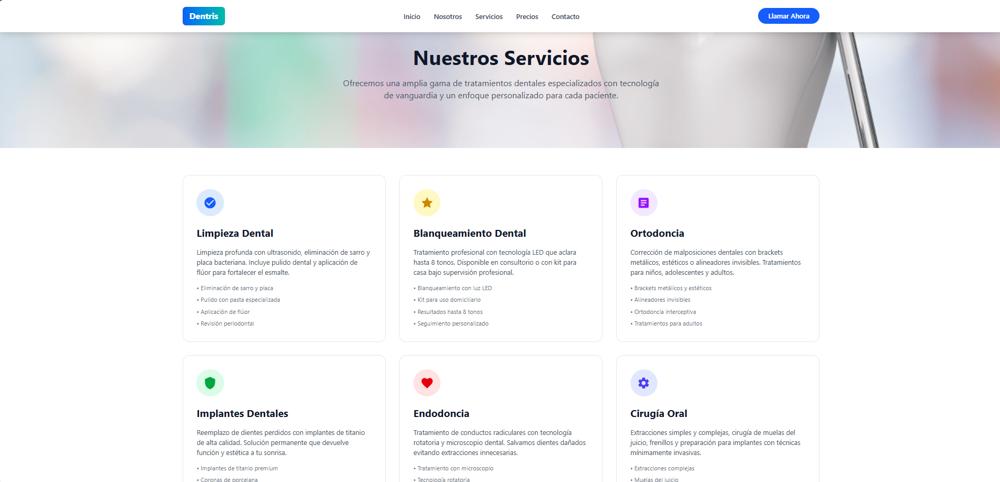
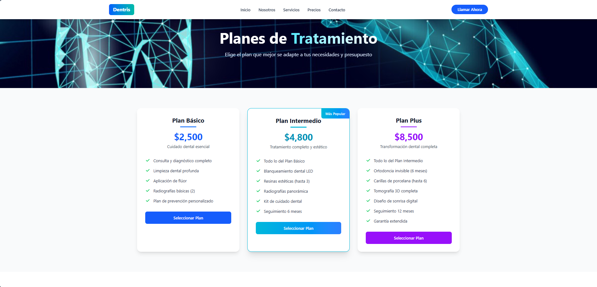
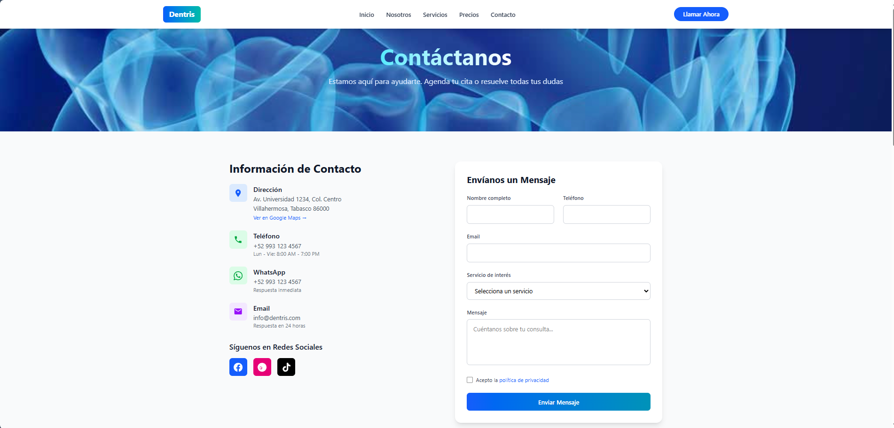

# 🦷 Dentris - Clínica Dental (Proyecto Demostrativo)

Dentris es un proyecto web multipágina desarrollado como demostración práctica para ilustrar la creación de plataformas dinámicas, modernas y de alto rendimiento. Utilizando la temática de una clínica dental, este sitio sirve de portafolio para exhibir la integración de experiencias de usuario premium con micro-animaciones fluidas, diseño responsivo avanzado y flujos de navegación estructurados para la presentación de servicios profesionales.


---

## 🚀 Tecnologías Utilizadas

Este proyecto fue construido utilizando herramientas modernas de desarrollo web:

- **[Astro 5](https://astro.build/)**: Framework web moderno optimizado para la velocidad y generación de sitios estáticos (SSG).
- **[Tailwind CSS v4](https://tailwindcss.com/)**: Framework de diseño centrado en utilidades configurado nativamente mediante Vite para un rendimiento y compilación ultrarrápidos.
- **[Vite 6](https://vite.dev/)**: Servidor de desarrollo y empaquetador de módulos de última generación.
- **[pnpm](https://pnpm.io/)**: Gestor de paquetes rápido, eficiente con el almacenamiento en disco e inteligente con las dependencias.

---

## 📁 Estructura del Proyecto

El proyecto está organizado siguiendo las convenciones de Astro:

```text
/
├── public/                # Recursos estáticos (imágenes de marca, iconos, etc.)
├── src/
│   ├── components/        # Componentes reutilizables de UI (cabeceras, pies de página, botones, etc.)
│   ├── layouts/           # Plantillas principales del sitio (Layout.astro)
│   ├── pages/             # Páginas/Rutas del sitio
│   │   ├── index.astro    # Página de inicio (Landing principal con Hero, Galería y CTA)
│   │   ├── nosotros.astro # Sección de información de la clínica y equipo médico
│   │   ├── servicios.astro# Lista detallada de tratamientos y servicios bucales
│   │   ├── precios.astro  # Planes de precios e información de cotizaciones
│   │   └── contacto.astro # Formulario de contacto, mapa y enlaces rápidos
│   ├── styles/            # Archivos de estilos CSS globales
│   └── images/            # Imágenes locales del proyecto
├── astro.config.mjs       # Configuración de Astro y plugin de Tailwind v4
├── package.json           # Dependencias y scripts del proyecto
└── tsconfig.json          # Configuración de TypeScript
```

---

## 🛠️ Comandos de Desarrollo

En este proyecto utilizamos **`pnpm`** como gestor de paquetes. Asegúrate de tenerlo instalado globalmente antes de ejecutar los comandos.

### 1. Instalar dependencias
Para realizar una instalación limpia de las dependencias definidas en el proyecto:
```bash
pnpm install
```

### 2. Iniciar servidor de desarrollo
Para iniciar el servidor local con recarga en tiempo real (Hot Module Replacement):
```bash
pnpm dev
```
El sitio estará disponible por defecto en: `http://localhost:4321`

### 3. Compilar para producción
Para generar una build optimizada y lista para desplegar en producción:
```bash
pnpm build
```
Los archivos de distribución se generarán en la carpeta `dist/`.

### 4. Vista previa de producción
Para probar la compilación de producción de manera local:
```bash
pnpm preview
```

### 5. Consola CLI de Astro
Para ejecutar comandos de la interfaz de comandos de Astro (por ejemplo, agregar integraciones):
```bash
pnpm astro [comando]
```

---

## 🎨 Características de Diseño
- **Estilo HSL y Degradados Modernos**: Uso de combinaciones de colores vibrantes en tonos azulados y verde menta que transmiten limpieza y salud bucal.
- **Micro-animaciones**: Transiciones interactivas con `hover` en botones, tarjetas de servicios y en los elementos decorativos animados del fondo.
- **Optimización de Dispositivos**: Diseño 100% responsivo para móviles, tablets y ordenadores.

---

## 📸 Capturas de Pantalla

A continuación se muestran las secciones principales diseñadas para este proyecto:

### 🛠️ Servicios


### 💳 Precios


### ✉️ Contacto

